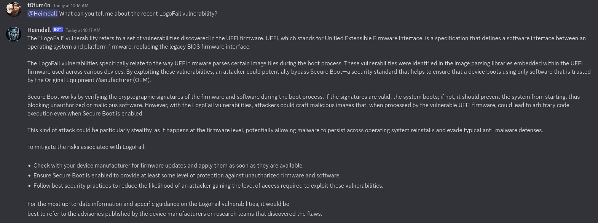
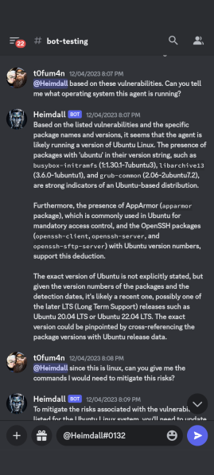
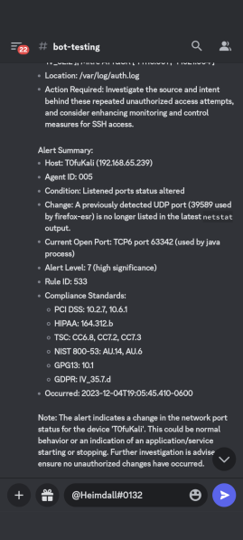

# Heimdall Discord Bot

## Description
Heimdall is a sophisticated, "ChatGPT" powered, Discord bot focused on cybersecurity and designed to interact with users, manage chat history, and perform various automated tasks related to cybersecurity and threat news aggregation. It integrates Discord and OpenAI's GPT-4 model to provide intelligent and contextual responses about your SIEM alerts or threats in the news as they pertain to your org.

## Features
- **Automated Scripts Execution**: Executes various Python scripts for summarizing news feeds, managing alerts, and checking vulnerabilities.
- **Advanced Chat Interaction**: Utilizes GPT-4 for intelligent, contextually relevant responses in Discord chats. The model employed, 'gpt-4-1106-preview', boasts an extensive 128k token context length, enabling the bot to maintain a large chat history. This large context length is pivotal in stacking extensive chat histories and side-loading data like SIEM alerts or summarized threat news feeds. This enhances the bot's ability to provide informed answers beyond the capabilities of regular ChatGPT models.
- **Chat History Management**: Efficiently maintains and manages the size of chat interaction history.
- **Vulnerability Checks**: Runs scripts to identify vulnerabilities for specific agents.
- **Alerts Summarization**: Automatically summarizes and presents alerts from a JSON file for quick review.
- **Custom Discord Commands**: Offers a range of Discord commands for interactive user engagement.

## Future Features
- **Incident Response Case Managment**: Interact with the ClickUp API to CRUD tasks.
- **More Threat Feeds**: CISA KEV, Twitter, Reddit, etc
- **Lockdown host with chat**: Ask Heimdall to contain a host and he will lock it down from a firewall perspective and begin an analysis of the host to see if it is infected or not.
- **Executive Reporting Help**: Create automations that use Heimdall to generate automated reports for executive digestion. Get information about your stack in context to threat intel and program maturity fed to upper management in a way they can understand. 

## Setup and Installation
To set up the Heimdall Discord Bot, you will need:
- Python 3.x
- Discord and OpenAI API keys
- Required Python packages: `discord.py`, `asyncio`, `subprocess`, and others as per the requirements.

## Configuration
1. Clone the repository.
2. Install dependencies using `pip install -r requirements.txt`.
3. Configure the API keys in the `keys` module.
4. Set up the bot on Discord and obtain the bot token.
5. Run the bot using `python heimdall.py`.
6. Note: The threat news feed function is turned off with a comment at the bottom of the main bot script. The reason this is turned off is because it can take a bit of time to process the intitial summarization of the threat news feed and really doesnt need to be on for test. 

## Usage
- **Chat with the Bot**: Mention Heimdall or include 'Heimdall' in your message in Discord.
- **Discord Commands**:
  - `/getvulns`: Check vulnerabilities for a specified agent.
  - `/sumalerts`: Summarize current alerts.
  - `/forget`: Manage chat history size.

## Contributing
Contributions to the Heimdall Discord Bot are welcome. Please follow the standard fork-and-pull request workflow.

## License
[MIT License](LICENSE.md)

---

## Disclaimer
- This is not meant to be a production application. 
- This is solely meant as a proof of concept and fun thing to play with. 
- This in no way is meant to adhere to any best practices for coding or development.
- This is based solely on my interpretation on how tools like this can be used.
- I used ChatGPT HEAVILY to assist with the code. I am not a professional developer and I make no claims to be. 

## Screenshots

Below are some examples of Heimdall Discord Bot in action:

  <strong>Questioning Heimdall about a Recent Vulnerability</strong> 
   
  <em>Heimdall's response to a query about a recent vulnerability.</em>

  <strong>Identifying Operating System Based on Vulnerabilities</strong> 
   
  <em>Heimdall identifying an operating system based on listed vulnerabilities.</em>

  <strong>Alert Summarization Feature</strong> 
   
  <em>Heimdall summarizing an alert for easy understanding.</em>

